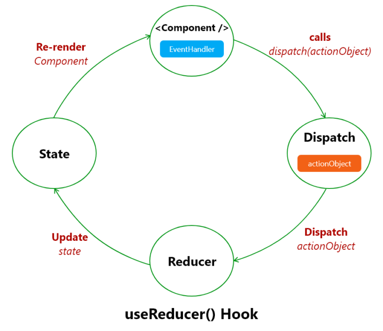

# UseReducer Hook / Montag 03.02.25

## Lernziele :

1. UseReducer Sytax:

```js
const [state,dispatch]=useReducer(reducer, initialState, init?);
```

- _English_:
- **`state`**: Holds the current state, which is derived from the `initialState` parameter in the `useReducer` hook. The state is recalculated whenever an update occurs.
- **`dispatch`**: A function that sends an action to the `reducer` to update the state and trigger a re-render of the component.
- **`reducer`**: A pure function that takes the current state and an action as arguments and returns a new state. It must not have any side effects.
- **`initialState`**: The initial value of the state used by the `useReducer` hook. It can be of any type.
- **`init`** (OPTIONAL): A function that returns the `initialState`. It is used when deriving the initial state from a function instead of passing a direct value.

- _Deutsch_:
- **`state`**: Enthält den aktuellen Zustand, der vom `initialState`-Parameter im `useReducer`-Hook abgeleitet wird. Der Zustand wird bei jeder Aktualisierung neu berechnet.
- **`dispatch`**: Eine Funktion, die eine Aktion an den `reducer` sendet, um den Zustand zu ändern und die Komponente neu zu rendern.
- **`reducer`**: Eine reine Funktion, die den aktuellen Zustand und eine Aktion als Argumente erhält und einen neuen Zustand zurückgibt. Sie darf keine Nebenwirkungen haben.
- **`initialState`**: Der Anfangswert des Zustands, der vom `useReducer`-Hook verwendet wird. Er kann von beliebigem Typ sein.
- **`init`** (OPTIONAL): Eine Funktion, die den `initialState` zurückliefert. Sie wird verwendet, um den Anfangszustand aus einer Funktion abzuleiten, anstatt direkt einen Wert zu übergeben.

2. Wie, Warum, Wann wird es benutzt ?

- 

### Resources :

- [useReducer Docs](https://react.dev/reference/react/useReducer)

- [useReducer Video](https://www.youtube.com/watch?v=kK_Wqx3RnHk)

### Tasks:

1. [useReducer Chellanges 1-4](https://react.dev/learn/extracting-state-logic-into-a-reducer#why-are-reducers-called-this-way)

2. []()

3. []()
